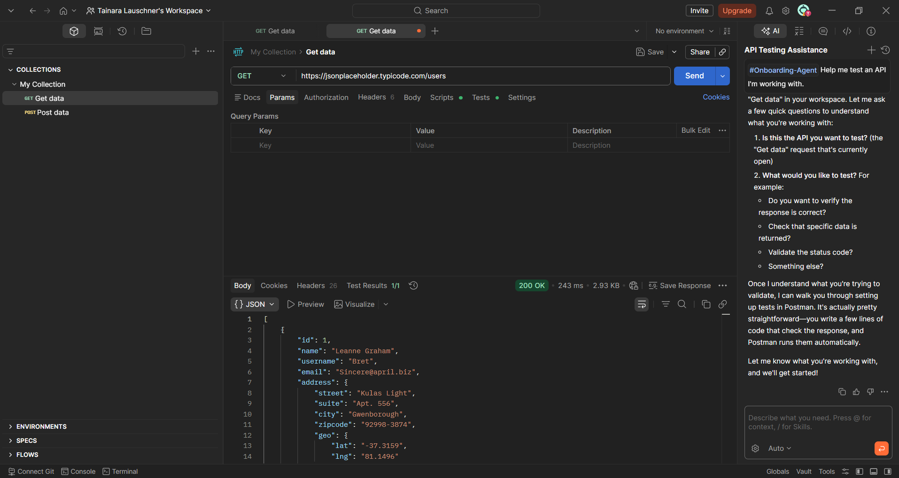
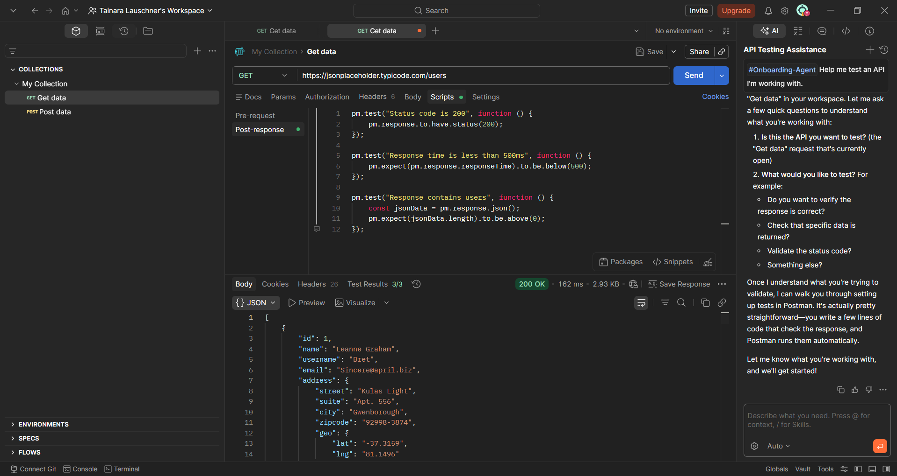
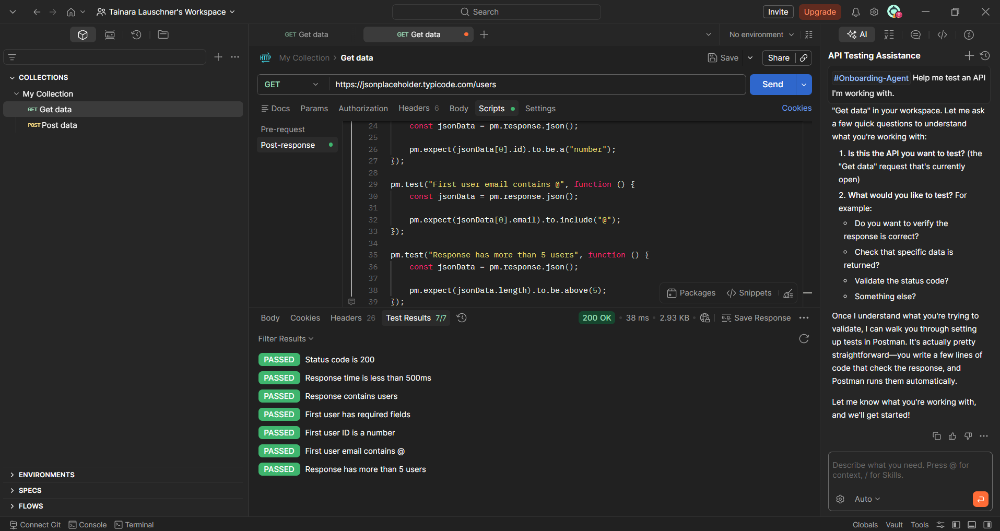
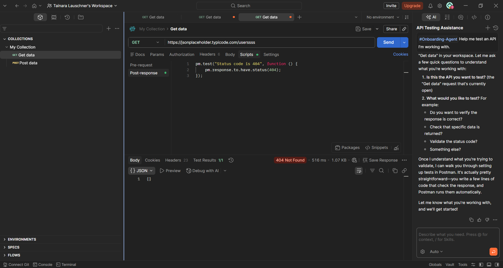

# QA Project – API Testing with Postman

## Project Summary

This project demonstrates API testing using Postman, including positive and negative test scenarios. The tests validate response status, performance, data structure, and error handling.

The goal is to simulate real QA activities, ensuring that the API behaves correctly under different conditions.

---

## Tested API

JSONPlaceholder API  
https://jsonplaceholder.typicode.com/

---

## Objective

Perform API testing to validate:

- Response status codes  
- Response time (performance)  
- Data integrity and structure  
- Business rule consistency  
- Error handling (negative scenarios)  

---

## Tools Used

- Postman  
- JSONPlaceholder API  

---

## Test Scenarios

### Positive Test – GET Users

**Endpoint:**

```txt
GET https://jsonplaceholder.typicode.com/users
```

### Validations performed:

- Status code is 200
- Response time is less than 500ms
- Response contains users
- First user has required fields (id, name, username, email)
- First user ID is a number
- First user email contains "@"
- Response has more than 5 users

### Result: 
7/7 tests passed

---

### Negative Test – Invalid Endpoint

**Endpoint:**

```txt
GET https://jsonplaceholder.typicode.com/userssss
```
### Validation performed:

Status code is 404

### Result: 
Test passed (error correctly handled)

---

## Evidence:

### GET Users Request


---

### Validations Applied


---

### Complete Test Results (7/7 Passed)


---

### Negative Test – 404 Error


---

## Skills Practiced
- API Testing
- Postman
- Manual Testing
- Status Code Validation
- Response Time Analysis
- JSON Data Validation
- Negative Testing
- Test Documentation

---

## Author

Tainara Lauschner
QA Analyst in training
https://github.com/tainaralauschner